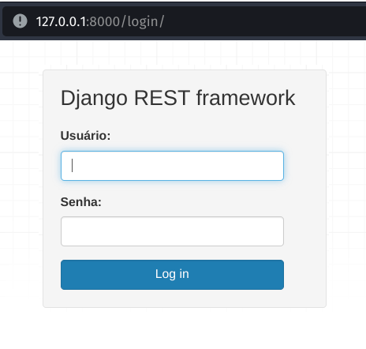
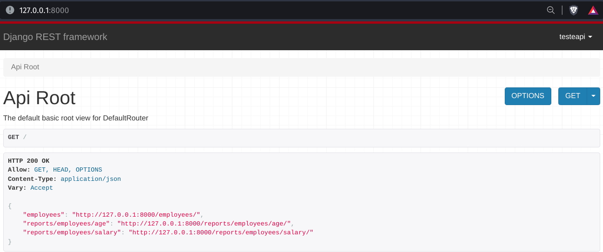
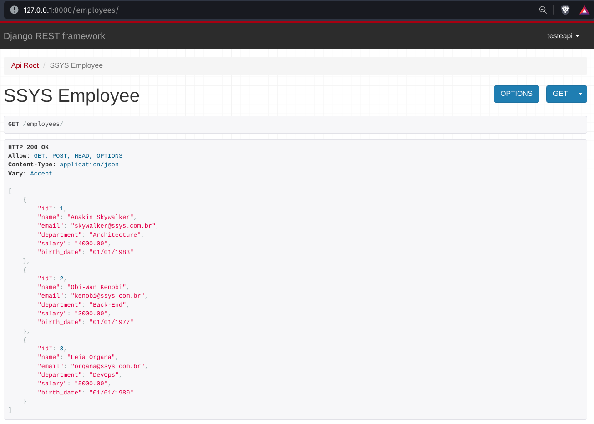
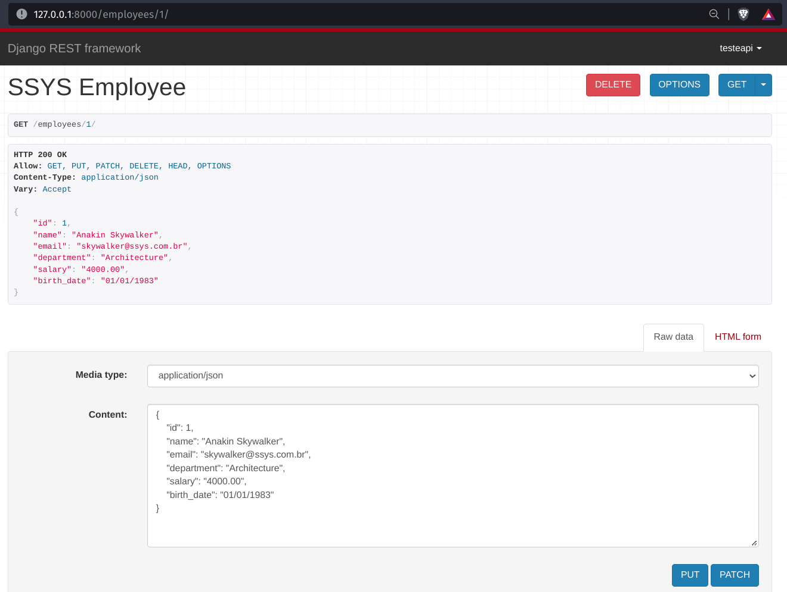
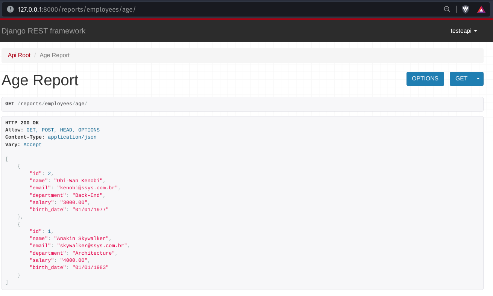
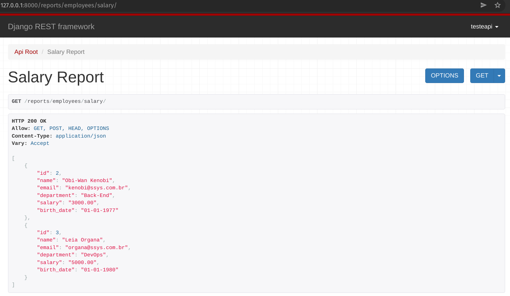

# SSYS-Employee-Manager

### Aplicação Rodando no Ambiente Local:
- Login:



- Rota Inicial:



- Employees:



- Employees Delete/Update:



- Employees Age:



- Employees Salary:



### Aplicação disponível ➔ [SSYS_EMPLOYEE](https://ssys-employee-manager.herokuapp.com/)
#### Login de visualização para a Aplicação:
#### Usuário: `testeapi`
#### Senha: `testeapi`

#### Api para integração. Processo Seletivo.

### Instruções para instalação.

#### Criar e ativar ambiente virtual Python (venv):

`python -m venv .venv`

`source .venv/bin/activate`

#### Instalar dependências:
`pip install requirements.txt`

#### Instalar dependências, inclusive de desenvolvimento:
```pip install requirements-dev.txt```

#### Criar o Projeto:
`django-admin startproject "nomedoseuprojeto" .`

#### Criar a área de administração e as tabelas iniciais:
`python3 manage.py migrate`

#### Criar o Super Usuário:
`python3 manage.py createsuperuser`

#### Copiar variáveis de ambiente:
`cp contrib/env-sample .env`

#### Rodar Aplicação Django:
`python manage.py runserver`

## DJANGO REST FRAMEWORK
#### Criar o app:
- Criar uma pasta de nome app no diretorio do projeto. 

`django-admin startapp "nomedoapp"`

#### Arquivo (settings.py):

- Adicionar os apps.

`apps."nomedoapp"", rest_framework,`

#### Configurar (models.py):
- Criar as classes.

#### Registrar os Models (admin.py):
- Registro dos modelos.

#### Na pasta da aplicação criar a pasta (api):
- Criar os arquivos (serializers.py) e (viewsets.py).

#### 08 - CONFIGURAR MINHAS ROTAS (urls.py):
- Criar as urls.

# Deploy no Heroku

### Configurações iniciais:
- Criar uma conta no Heroku (https://www.heroku.com/)
- Instalar a CLI do Heroku (https://devcenter.heroku.com/articles/heroku-cli)
- Verificar a Instalação `heroku --version
- Ativar o ambiente virutal. `source venv/bin/activate`

#### Personalizar o settings.
- Configuração do whitenoise = (http://whitenoise.evans.io/en/stable/) 

#### Especificidades do Heroku:
- Servidor wsgi recomendado pelo Heroku.

`gunicorn`

#### Postgress:
- Adaptador de Postgres para o Python.

`psycopg2`

#### Criar o arquivo runtime.txt:

- Colocar a versão do seu python.

`python-3.9.10` 

#### Criar o arquivo Procfile:

`release: python3 manage.py migrate`

`web: gunicorn "nomedaapp".wsgi --preload --log-file -`

## Comandos Necessários para o Deploy
- Fazer login no Heroku:

`heroku login`

- Criar um app heroku: 

`apps:create nomedaapp`

- Configurar as variáveis de ambiente:

`heroku config:set` - Com as variáveis.

#### Criar o banco de dados:
`heroku addons:create heroku-postgresql:hobby-dev`

#### Colocar a aplicação no ar:
`git push heroku main`

#### Abrir a aplicação:
`heroku open`

#### Criando as tabelas para o Banco de Dados:
`heroku run python manage.py migrate`

#### Criando usuário:
`heroku run python manage.py createsuperuser`

### Monitorando falhas da aplicação:
- Instalar o Sentry.
- Realizar as configurações conforme documentação.
- [Documentação ➔ Sentry.io](https://docs.sentry.io/platforms/python/guides/django/)
